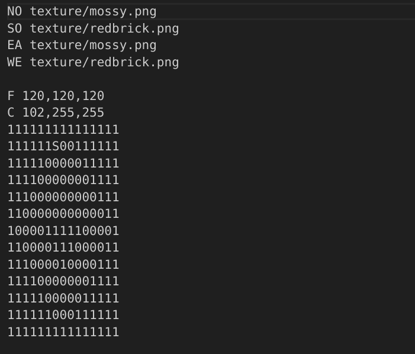

# cub3D


*Creating a 3D graphical representation of the inside of a maze from a first-person perspective by using a Ray-Casting algorithm.*

## Usage
- **Execute**
```
$ make
```
```
$ ./cub3D ./maps/default.cub
```
- **Move** \
`W`,`A`,`S` and `D` keys
- **Rotate** \
`←` or `→` Left or right arrow keys
- **Quit** \
Pressing `ESC` or Clicking a `cross button` on the window's frame.

## *Parser*
Parsing all information from a `.cub` file to execute.\
A `.cub` file contains below informatin.
  - ##### A map is composed of `1`(wall) and `0`(empty space).
  - ##### Player's start position and orientation(`N`,`S`,`E` or `W`).
  - ##### The texture path of each wall according to the direction.\
    North texture : `NO ./path_to_the_north_texture`\
    South texture : `SO ./path_to_the_south_texture`\
    West texture  : `WE ./path_to_the_west_texture`\
    East texture  : `EA ./path_to_the_east_texture`
  - ##### Floor and Ceiling RGB color\
    Floor color : `F 200,100,0`\
    Ceiling color : `C 225,30,0`
  
